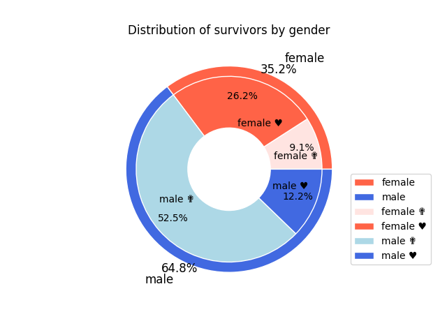
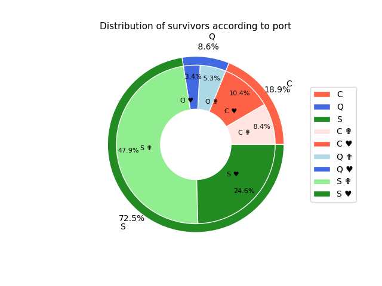
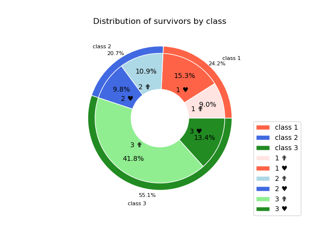

---
jupytext:
  formats: md:myst
  text_representation:
    extension: .md
    format_name: myst
    format_version: 0.13
    jupytext_version: 1.20.0
kernelspec:
  name: python3
  display_name: Python 3 (ipykernel)
  language: python
---

# Titanic Passenger Data Analysis

---

A modular Python project exploring the Titanic dataset through data cleaning, exploratory data analysis, and visualization.

This project investigates how different factors such as gender, age group, embarkation port, and passenger class influenced survival rates during the Titanic disaster.

---

# Project Structure

```text
Titanic/
├── data/
│   └── Titanic.csv
│
├── outputs/
│   ├── survival_by_cabin.png
│   ├── survival_by_gender.png
│   └── survival_by_port.png
│
├── data_loader.py
├── gender.py
├── children.py
├── port.py
├── cabin.py
├── main.py
│
├── REPORT_EN.ipynb
├── REPORT_FR.ipynb
└── running.ipynb
```

---

# Features

- Modular Python project structure
- Data loading and preprocessing
- Survival analysis by:
  - Gender
  - Age group
  - Embarkation port
  - Passenger class
- Automatic chart generation with Matplotlib
- Separation between analysis logic and execution workflow

---

# Technologies Used

- Python
- Pandas
- NumPy
- Matplotlib
- Jupyter Notebook

---

# How to View and Run the Project

This repository can be used in two different ways:

1. **Quick review on GitHub**  
   The notebook reports can be opened directly on GitHub. They already contain the analysis outputs, tables and visualizations, so no installation is required for a first review.

2. **Full local execution**  
   The Python source files can be run locally to reproduce the analysis and regenerate the charts.

---

## Option 1 — View the Reports Directly on GitHub

For a quick review, open one of the notebook reports:

- `REPORT_EN.ipynb` — English report
- `REPORT_FR.ipynb` — French report

These reports are intended for portfolio presentation. They summarize the analysis in a readable notebook format and include the main outputs of the project.

---

## Option 2 — Run the Project Locally

To reproduce the analysis on your own machine, first clone the repository:

```bash
git clone https://github.com/your-username/your-repository-name.git
cd your-repository-name
```

Then install the required Python packages.

If a `requirements.txt` file is provided, run:

```bash
pip install -r requirements.txt
```

Alternatively, the main dependencies can be installed manually:

```bash
pip install pandas numpy matplotlib jupyter
```

Finally, run the main Python script:

```bash
python main.py
```

The generated visualizations will be saved automatically inside the `outputs/` directory.

---

## Option 3 — Run with GitHub Codespaces

The project can also be executed online with GitHub Codespaces.

On the repository page:

1. Click the green **Code** button.
2. Open the **Codespaces** tab.
3. Click **Create codespace on main**.
4. Once the environment is ready, run:

```bash
pip install -r requirements.txt
python main.py
```

If no `requirements.txt` file is available, install the dependencies manually:

```bash
pip install pandas numpy matplotlib jupyter
python main.py
```

---

# Example Analyses

## Survival Rate by Gender

The project compares male and female survival rates and visualizes the results using bar charts.

## Survival Rate by Passenger Class

The analysis investigates how ticket class influenced survival probability.

## Survival Rate by Embarkation Port

Passenger survival is compared across embarkation locations (`C`, `Q`, `S`).

---

# Output

Generated visualizations are automatically saved inside the `outputs/` directory.

Example:

<div align="center">




</div>

<br>

<div align="center">



</div>

---

# Purpose of the Project

This project was created as a practice exercise in:

- Exploratory data analysis (EDA)
- Python project organization
- Data visualization
- Modular programming

The original notebook-based workflow was progressively refactored into reusable Python modules to improve code readability, maintainability and reproducibility.

---

# Author

Sichao Jing  
Mathematics & Economics Student — Université Paris-Saclay
